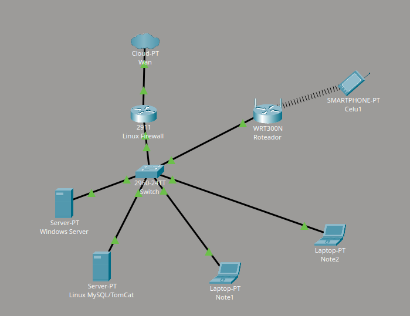

# Sobre a Empresa

A **ConnectStar** é uma empresa especializada em serviços de infraestrutura de TI, manutenção de computadores e implementação de redes locais corporativas.

Nossa equipe atua na montagem, configuração e gerenciamento de ambientes computacionais, oferecendo soluções voltadas para conectividade, organização de redes, segurança e suporte técnico para pequenas e médias empresas.

Entre os serviços realizados pela empresa estão:

- montagem e manutenção de computadores
- implantação de redes locais (LAN)
- configuração de roteadores e access points
- implementação de servidores Linux e Windows
- gerenciamento de infraestrutura corporativa
- configuração de firewall e segurança de rede
- suporte técnico e manutenção preventiva

Neste projeto, a empresa foi contratada pela **Sysccode**, responsável pelo desenvolvimento do sistema **AutoLoc**.

O AutoLoc é uma aplicação desenvolvida com o objetivo de localizar serviços automotivos na cidade de São Paulo, funcionando de maneira semelhante a plataformas de geolocalização e mapas, permitindo que usuários encontrem oficinas, auto elétricas, borracharias, mecânicas e outros serviços automotivos próximos de sua localização.

Nossa equipe ficou responsável pela implementação de toda a infraestrutura necessária para o funcionamento da aplicação, incluindo:

- servidor Linux para hospedagem da aplicação
- banco de dados MySQL
- servidor Apache Tomcat
- Windows Server
- firewall Linux
- rede local corporativa
- conectividade LAN e Wi-Fi
- organização e segurança da infraestrutura

O objetivo do projeto é garantir que o sistema AutoLock funcione de maneira segura, estável e organizada, permitindo a comunicação entre servidores, banco de dados e dispositivos conectados à rede corporativa da empresa.

# Topologia da Infraestrutura

- Link para o download do diagrama da rede: [Infraestrutura](https://github.com/lbruss/integrator-project1/raw/refs/heads/main/infraautoloc.pkt)

# Membros da Empresa

| Nome | Cargo |
|---|---|
| Bruss Loza | Gerente de Infraestrutura / Líder Técnico |
| Eduardo Mantovani | Administrador Windows Server |
| Enzo Becker | Analista de Infraestrutura Windows |
| Ruan Anderson | Analista de Segurança e Firewall |
| João Vitor | Técnico de Redes |
| Daniel Vieira | Analista de Redes e conectividade |
| Ezequiel Soares | Técnico de Redes e Firewall |
| Victor Gabriel | Administrador Linux e Banco de dados |
